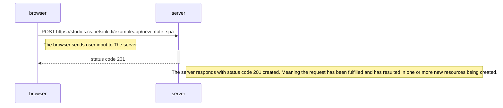

```mermaid
    sequenceDiagram
    participant browser
    participant server

    browser->>server: POST https://studies.cs.helsinki.fi/exampleapp/new_note_spa

    Note right of browser: The browser sends user input to The server.

    activate server
    server-->>browser: status code 201
    deactivate server

    Note right of server: The server responds with status code 201 created. Meaning the request has been fulfilled and has resulted in one or more new resources being created.

```